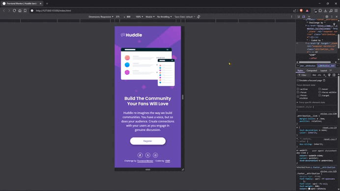

# Frontend Mentor - Huddle landing page with single introductory section solution

Responsive landing page built as part of a [Frontend Mentor Challenge](https://www.frontendmentor.io/challenges/huddle-landing-page-with-a-single-introductory-section-B_2Wvxgi0).  
The project focuses on semantic HTML, modern CSS, accessibility, and responsive design principles

---

## 📸 Screenshots

### 📱 Mobile - Default & Focus States


### 💻 Desktot - Default State


### 💻 Desktot - Hover State

 |


---

## 📽️ Demo



---

## 🔗 Links

- [Live site](https://vimpdev.github.io/fem-02-huddle-landing-page/)

- [Frontend Mentor solution](https://www.frontendmentor.io/solutions/mobile-first-responsive-huddle-landing-page-ga4ilz1IP5)

---

## 🧠 The Challenge

Users should be able to:

- View the optimal layout depending on their device screen size
- See hover states for interactive elements
- Experience accessible focus states for keyboard navigation

---

## 🛠️ Built with

- Semantic HTML5
- Modern CSS
- Flexbox
- CSS Grid
- Mobile-first workflow
- Accessible focus-visible states

---

## 💡 What I learned

- Structuring layouts using a mobile-first approach.
- Implementing accessible `:focus-visible` states for better keyboard navigation.
- Managing responsive spacing and layout adjustments using CSS Grid and Flexbox.
- Writing cleaner and more intentional commit messages following conventional commits.

Example of accessible focus handling:

```css
button:focus-visible {
  outline: 2px solid #fff;
  outline-offset: 4px;
}
```

---

## 🤖 AI Collaboration

AI tools were used strategically to:

- Refine commit message conventions.
- Improve meta tag implementation (SEO & Open Graph).
- Review accessibility practices.
- Improve documentation quality.

All implementation decisions and final code structure were reviewed and adjusted manually.

---

## 👤 Author

- Frontend Mentor - [@vimpdev](https://www.frontendmentor.io/profile/vimpdev)